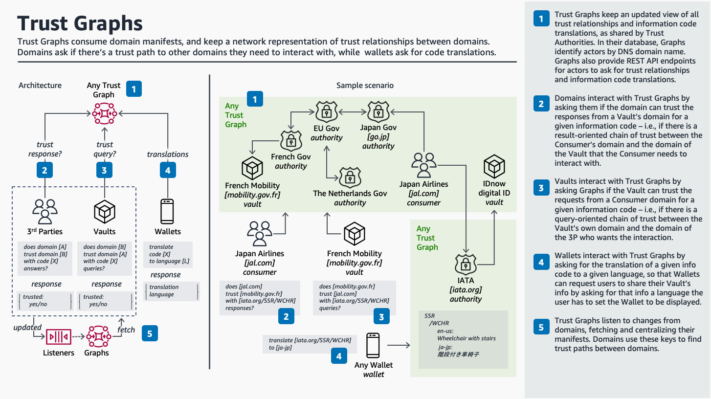

<h1 align="center">
Domain Trust Framework
 

</h1>

### Architecture

Target architecture:

  

### Usage

#### Prerequisites
To deploy the solution,

1. Clone the repository to your local machine.
    * `git clone https://github.com/manesb/domain-trust-framework.git`

3. Deploy the solution
    * `sam build --template ./cfn/domain/domain.template`
    * `sam deploy --stack-name DTF --region <AWS_REGION>  --resolve-s3 --capabilities CAPABILITY_NAMED_IAM CAPABILITY_AUTO_EXPAND`

4. Please note down the api endpoint

### Outputs                                                                                                                                          

Key:                 SyncApiStack                                                                                                                 
Description:         API URL                                                                                                                      
Value:               https://<ID>.execute-api.<AWS Region>.amazonaws.com/dev                                                                   

## Test the example

You can test using api clients e.g. curl

### Clean up

`
sam delete DTF
`

### Conclusion

Domain Trust Framework

## Security
See [CONTRIBUTING](CONTRIBUTING.md#security-issue-notifications) for more information.

## License
This library is licensed under the MIT-0 License. See the LICENSE file.
